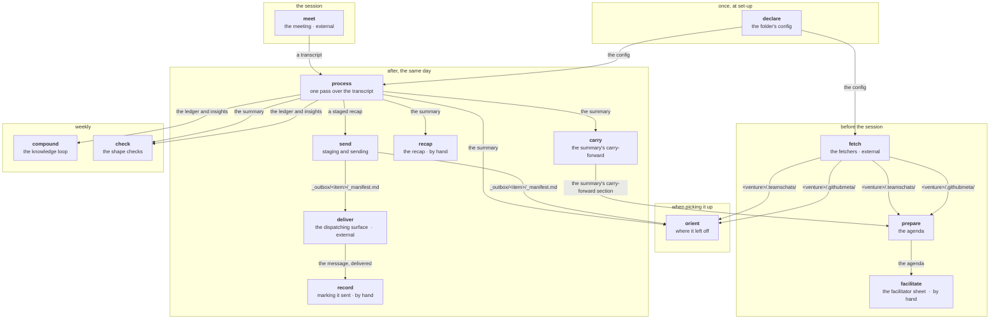

# core-skills

**Version:** 1.79.0

**[core-skills.doable.services](https://core-skills.doable.services)** — what it is, how a day fits together, install guide and FAQ.

Claude Code skills for operational documentation, transcript processing, task tracking, and team coordination — with a **knowledge loop** that compounds: every meeting feeds an insights corpus, confirmed patterns become standing rules for the skills, and the corpus is synthesized into a crosslinked knowledge wiki with a read-first index. Capture once; the system gets smarter and the knowledge stays readable.

**Releases:** [`CHANGELOG.md`](CHANGELOG.md) — 122 entries, newest first. This
file used to repeat the last 34 of them; it no longer does, because a second
copy of a changelog is a second thing to keep true.

## Before the loop: reading the room

<!-- orientation:start -->
Generated from `orientation` in [`ecosystem.yaml`](ecosystem.yaml) — do not edit here (CR-077).

Two onboardings produced the same questions, and none of them were about the loop below. They
were about the substrate: which folders are read, which are sealed, what is in the context
window, where a session starts. **A person cannot run the loop before they can read the room.**

| | |
|---|---|
| Where do I start a session, and why does it matter? | Start inside the vault folder, not your home directory. A session started above the vault searches everything beside it too, and answers then mix material from places that have nothing to do with each other. The vault root is the folder holding _inbox/ and _outbox/. |
| What are inbox and outbox? | _inbox/ is where unprocessed input lands and waits to be classified — a door, not a home, so it normally holds very few files. _outbox/ is where outgoing material is staged before it is sent, and it keeps the record of what was sent when. One of each, both at the vault root; per-folder copies are not part of the contract. |
| Why do some folders start with a dot and others with an underscore? | The prefix answers one question: is this read in everyday work? Underscore means yes and sorts it to the top. Dot means rarely, on demand, or never. Who WRITES a file is a separate thing and never a reason for a prefix — _insights.yaml is machine-written and still carries an underscore, because skills read it automatically. |
| What is .transcripts/, and how do I get the raw text when I need it? | Raw transcripts are kept there as the audit trail behind a summary. The summary is what the vault treats as true; the raw material is not read back and quoted into new documents, because a summary that keeps being re-derived stops being a decision. Ask for it explicitly when you need it — it is sealed, not hidden. |
| New window or resume — when do I want which? | Resuming restores exactly where you left off, including everything already read in — but it knows nothing about files changed since. Start a new window when the subject changes, or when files have moved underneath you, and read in only what that work needs. Two windows can run against the same files without knowing about each other. Nothing is implicit: what is in the window is what was read into it. |
| How do I paste something in safely? | Say what it is and where it came from on the line above, then put the material itself in a fenced block. Fenced, it is read as data. Unfenced, a sentence inside it that reads like an instruction can be followed as one — which is a property of the pasted text, not of your intent. |
| Does the structure have to be right from the start? | No, and trying to make it right first is the most common way to stall. Put the material in; the structure is proposed from what is actually there and changes as more arrives. A folder tree invented before the content exists describes work nobody has done yet. |
| Something is wrong in a file — do I edit it? | Say what is wrong and let the skill correct it. The files are readable on purpose and you may open any of them, but a correction made by hand is invisible to everything that maintains the file, and the next run can write over it. Stating the correction keeps one writer per file. |
<!-- orientation:end -->

## How a project runs

<!-- working-loop:start -->


**14 steps, 6 phases.** Generated from `working_loop` in `ecosystem.yaml` — the same declaration the landing page reads. Do not edit this block by hand; run `python3 scripts/render-loop.py --write`.

**The loop closes at the summary.** What did not land in one session becomes the top of the next agenda, carrying a session count and an age — so an item cannot quietly outlive the series it belongs to.

**3 steps are deliberately by hand**, marked above. Each is a place where generating the obvious answer would be confidently wrong in a way the reader could not check:

- **facilitate** — The agenda carries facts; which question to ask is judgement, not generation
- **recap** — Whether a session warrants a recap is a judgement about the audience, not about the material
- **record** — That click is where the posted message gets read as it actually landed

<!-- working-loop:end -->

## Why it is shaped this way

Four months of heavy production use taught us where document pipelines actually fail — and the v1.21–v1.26 wave restructured the suite around those findings. The suite now works as **four cooperating layers**:

### 0. Retrieval — what the room never said

A meeting record is built from a recording, so **everything asynchronous is invisible to it by
construction**: decisions posted to a chat, issues opened overnight, a document linked an hour before
the meeting. That is not an oversight anyone can be careful about — the loop has one input where the
work has three.

A folder declares the chat and the repositories its work concerns (`external_systems`); archivers write
them to `<venture>/.teamschats/` and `<venture>/.githubmeta/`; and the agenda generator **reads those
archives, never the network**. An agenda therefore renders with no credential and no connectivity, and
a declared read scope is honoured where the archiver recorded it. This layer runs **before** the
meeting, not after.

### 1. Capture — get everything in, safely

`/inbox` (universal capture — text, audio, and since v1.28 **file drops** with a pass-through lifecycle to their real home), `/transcript` and `/ops` (meetings), `/preparation` (pre-meeting). One door, one pending list: everything enters through `_inbox` and nothing lives there (`.ephemeral/` is the declared opposite — scratch with no vault destiny, allowed to die). This layer is guarded by a **name-safety chain** built up over three releases, because word-fidelity errors propagate into everything downstream:

- **CR-015** — undiarized transcripts (no speaker labels) fail safe: inferred action-item owners are written `?`/`Name?`, never confidently guessed.
- **CR-016** — proper nouns that match no known entity are flagged (`⚠ Namn att verifiera`) instead of committed; a plausible wrong name is worse than an honest question mark.
- **CR-017** — a **people roster** (`people:` in config) covers the long tail of recurring names, and a **committed-spelling check** compares every draft name against what the folder has already published — so one person can no longer end up spelled three ways across a meeting series, and a real-word mishearing can't silently replace an established domain term.

### 2. Structure — formats that can't silently fork

Formats used to erode by *template forking*: one deviating file re-seeds its whole series, and every later file looks internally consistent. Now every save is checked against a **template contract** (CR-018: heading order, action-table columns, empty-decision marker), `/ops check` locates where an existing series forked, and the **slug contract** (CR-021) keeps filenames sortable and machine-readable. Deliberate format changes are made by editing the contract — an accidental fork becomes an explicit, reviewable decision.

### 3. Knowledge — insights that actually compound (loop closed in v1.31)

Every meeting silently accumulates durable insights (`_insights.yaml`); `/insights compile` promotes repeatedly-confirmed hypotheses to **rules** that are loaded back as context on future runs (CR-013), so the skills demonstrably get smarter in the folders you work in most. v1.21 (CR-020) hardened the loop: a write-time vocabulary guard stops schema drift at the source, `/insights migrate` migrates legacy files, and a `last_compiled` stamp makes a never-running synthesis loop visible instead of silent. v1.31 (CR-027) added the human-facing half: `/insights synthesize` renders the corpus into a **knowledge wiki** — crosslinked topic articles plus a master INDEX that sessions read first when answering knowledge questions, no RAG required.

### 4. Closure — the loop most systems never build

**Two kinds of closure, and the second was the late addition.** The first is folder-level rot. The
second is an item that never gets resolved *inside* a recurring series: a note ends with what did not
land, the next agenda is generated from it, and each item carries a session count **and an age** —
because a session is not a unit of time, and three sessions is three days on a daily series and two
months on a fortnightly one. Whichever threshold trips first, the agenda says so in itself. Owner is
read from a defined position and anything else reads `UNOWNED`, which is the finding rather than a parse
failure: an item nobody is named against is the one that falls through an agenda that lists it.

`/ops check` walks that chain, because it holds the one failure in the loop that announces nothing — a
note missing its section produces a next agenda with zero carry-forward items that **looks perfectly
correct**.

Append-only systems also rot quietly: indexes lag their folders, task ledgers freeze, sent material never gets archived, moved artifacts leave live-looking corpses, stray inbox/outbox folders quietly fork the pending list — and even the ecosystem's own components drift versions apart when their check has no scheduled reader. `/ops check` (CR-019, extended by CR-023/CR-025) detects all nine closure-debt classes in one read-only pass and offers the fixes (`/outbox close --all-sent`, tombstones per the retirement convention, `/inbox triage refresh`, the alignment runbook, merge-or-exempt for structural strays); run it weekly and staleness stops accumulating.

### A project using the full set

The layers above say why the suite is shaped this way. This is the order they actually run in, for one
project with everything enabled.

**Once, at set-up.** Create the folder and its config. Declare four things and the rest follows:
`external_systems` (which chat, which repositories, and the read scope), `workflows.post_processing`
(which of the four post-meeting artifacts this series wants), `workflows.meeting_templates` (the shape
contract), and `workflows.task_ledger` — **`external` where the work already has a register elsewhere**,
which is how a project avoids growing a second ledger beside the real one.

**Before each session.** Archivers refresh the chat and repository archives — external CLIs, run on
demand, never by a skill. `build_agenda.py` then writes the agenda: carry-forward items at the top with their
session count and age, then what the archives hold that the room has not heard. **The facilitator sheet
is written by hand** — the agenda carries facts, and turning a fact into the right question is
judgement, not generation.

**After each session, the same day.** Choose the transcript source: duplicates are the normal case, one
per capturing tool, so **list them and let a person pick** rather than choosing on their behalf. Then
`/ops` makes one pass — the summary, the registers, one changelog line — and Step 9 runs what the
project declared: tasks imported or routed to the external register, the slim priorities artifact for
the people doing the work, **the summary's carry-forward section**, and **the recap offered rather than
written**.

**`/outbox` stages what goes out**, as a folder with a manifest. The manifest's status is the only
record that something was actually sent, and **a person advances it** — that click is where the posted
message gets read.

**Weekly.** `/insights compile` promotes confirmed hypotheses to rules; `/insights synthesize` renders
the wiki; `/ops check <folder>` checks the shape contracts and the carry-forward chain, and `/ops check`
with no folder finds the closure debt across the vault. `/ops orient <folder>` says where a project
stands whenever you pick it up.

**When something belongs elsewhere.** `/outbox close` files a resolved send into the recipient's
folder. `/handoff` freezes a bounded subject for a different piece of work — self-contained, indexed
nowhere, and moved only when a human opens it.

**Three steps are manual, and all three are deliberate:** the facilitator sheet, choosing between
duplicate sources, and asking before a recap. None is an unbuilt feature. Each is a place where
generating the obvious answer would be confidently wrong in a way the reader could not check.

### The triage surface — where the human stays in charge

CR-022 formalizes what heavy real-world use converged on: a single markdown **triage doc** in `_inbox/` — paste-fast capture, human-sorted buckets (INKORG → PRIO → DENNA VECKA → SENARE), a done-archive. The design principle is inverted from everything else: **skills adapt to the triage doc; the triage doc never adapts to skills.** Preps pull the relevant open items automatically, the dashboard surfaces today's priorities, task import can target it, and `/inbox triage refresh` does the mechanical upkeep — but sorting and wording remain entirely human. It earns its place by matching how people actually work: a low-ceremony habit outlives any structured file it replaces.

### The development loop around it all

The suite is developed **on live production data**: real usage generates evidence, evidence becomes CRs, CRs become releases. That loop has its own guardrails (CR-026): [`docs/RELEASING.md`](docs/RELEASING.md) codifies the one-way membrane between the private operating vault and this public repo — generic-by-construction writing, a private CR archive, and a **fail-closed pre-push guard** that scans every outgoing line against secret patterns and a private identifier denylist. Ecosystem components (the visualiser, the landing page) are held on the same version by an alignment check that `/ops check` reads on schedule (CR-023).

---

## Skills included

| Skill | Description | User-invocable |
|-------|-------------|----------------|
| `inbox` | Universal entry point for unstructured content. Classifies voice memos, quick notes, emails, raw text **and file drops** (`_inbox/.files/`, CR-024) and routes them to their skill (`/inbox route`). Also maintains the **triage working surface** (CR-022): `/inbox triage refresh` does mechanical upkeep of a human-owned triage doc without ever reordering or rewording it. | Yes (`/inbox`) |
| `preparation` | The config-free form of `/ops prepare`: the agenda for a meeting with a contact, with a 60-second walk-in card on top and deep-dive content below the fold. Tagged questions ([DECISION]/[DEMO]/[STATUS]/[QUESTION]/[FYI]). Frozen at meeting time. | Yes (`/preparation`) |
| `transcript` | The config-free form of `/ops process`: a summary from a transcript of a call, meeting or voice recording. Action-first canonical structure (Nästa steg → Beslut → Konklusion → Diskussion → Bakgrund), three template variants by length, optional task import, insights to `_insights.yaml`. | Yes (`/transcript`) |
| `ops` | The config layer over `prepare` and `process`, plus the loop steps it owns. Subcommands are the loop's verbs: `orient`, `prepare`, `process` (the default), `check <folder>` (template contracts, carry-forward chain) and `check` (vault closure debt); `status` shows each project's resolved config; `project list` / `project new`; `normalize` repairs Swedish characters, names and filenames. | Yes (`/ops`) |
| `outbox` | Lifecycle management for `<vault>/_outbox/`. Lists pending items by reading each `_manifest.md`; closes resolved folders into the relevant contact or project folder while updating manifest, CHANGELOG and `_tasks.yaml` source paths. Subcommands: `list`, `status`, `close <folder>`, `close --all-sent`, `help`. | Yes (`/outbox`) |
| `tasks` | Personal task tracker with cross-project correlation. Per-folder ledgers, source linking, automatic carry-forward, privacy model. Subcommands: `list`, `add`, `done`, `import`, `weekly`, `archive`, `help`. | Yes (`/tasks`) |
| `handoff` | Frozen context documents in `<vault>/.handoff/`. One bounded subject from a conversation as a self-contained document a different work session can pick up cold. **Nothing in the suite picks it up: a human opens it.** Subcommands: `list`, `read <name>`, `help`. | Yes (`/handoff`) |
| `insights` | Knowledge extraction manager and skill evolution engine. Compiles execution feedback into patterns (hypothesis → rule), migrates drifted files to the current schema, **synthesizes the corpus into a wiki** (CR-027), proposes SKILL.md improvements. Subcommands: `reprocess`, `scan-claude-md`, `compile`, `migrate`, `synthesize`, `propose`, `status`, `help`. | Yes (`/insights`) |
| `analytics` | Vault-level content analytics -- file creation trends, skill adoption, contact engagement, content distribution, unprocessed backlog detection. Reads file metadata, not contents. Writes `_analytics/`. | Yes (`/analytics`) |
| `update-skills` | Skill repo management -- fetch/pull with version safety, symlink creation, health auditing, repo installation. | Yes (`/update-skills`) |
| `ops-base` | Shared operational framework (meeting formats, task management, workflows, archive policy). Base module referenced by the other skills. | No |
| `ops-config` | Configuration system -- schema definition and base defaults. | No |

**Two skills left in v1.79.0 (CR-089):** `daily-dashboard` was retired, and `md2pdf` moved to a
personal skill repository — neither was part of the loop, and no other skill read either.

## Shared contract: `ecosystem.yaml`

[`ecosystem.yaml`](ecosystem.yaml) is the single source of truth for the suite. Marvin (formerly core-skills-visualisation), the landing page, Trillian (vault-pulse), and any future external tools should read it instead of hard-coding skill lists, schema versions, or vault file paths.

It declares:

- **Schema versions** -- `ops_config`, `contact_meta`, `tasks`, `insights`
- **Insight type enums** -- content vs evolution
- **Contact classification** -- levels, defaults, folder pattern defaults (CR-009)
- **Skills registry** -- user-invocable + non-invocable, with badges and subcommands (declared in loop order, with one-release `aliases` for renamed subcommands)
- **`terms:`** (CR-089, contract 32) -- one entry per concept: the English identifier, its localized form, the loop step that produces it, the filename role keyword for new files, the legacy keywords every reader still accepts, and phrases to avoid. The naming rule that follows: a skill is a noun, a subcommand is a verb, one verb means one thing everywhere, and **the loop's step ids are the command verbs**. Identifiers (including filename role keywords) are English; what a person reads is localized, but only from `terms:`. Nothing existing is renamed — the rule applies forward
- **`vault_conventions`** (CR-010, contract_version >= 2) -- authoritative declaration of every file the suite produces or consumes in a user's vault. Each entry documents path pattern, purpose, schema link, writers, readers, and lifecycle. Three sections: `vault_root`, `per_folder`, and cross-cutting `rules` (vault-relative paths, single inbox/outbox, config resolution order, naming, audio/transcript pairing).
- **Visualisation features** -- the page list Marvin renders

The contract is versioned (`contract_version: 32`). Bumps are additive when possible -- older clients ignore unknown blocks; newer clients get the additional structured declarations. Run [`scripts/check-ecosystem-alignment.sh`](scripts/check-ecosystem-alignment.sh) after editing to verify Marvin's CLAUDE.md and the landing page reference the same `core_skills_version`; it also runs [`scripts/check-terms.py`](scripts/check-terms.py), which compares every SKILL.md's subcommands with the contract and rejects the `avoid:` phrases.

## Architecture

Skills are **organization-agnostic**. They use a layered configuration system (rewritten in v1.16.0 -- CR-011):

1. **Project-level** (`.claude/ops-config.yaml`) -- overrides for specific projects
2. **Folder-local** (`<vault>/<org>/_ops.yaml`) -- per-config, walked up from CWD until vault root
3. **Vault-wide** (`<vault>/_config/base.yaml`, optional) -- overrides shared across all folders
4. **Base defaults** (`~/.claude/skills/ops-config/base.yaml`) -- fallback values

Pre-v1.16.0 chain (`~/.claude/skills/{org}-ops-config/{org}.yaml`) is deprecated, removed in v1.17.0. See CHANGELOG `[1.16.0]` `### Migration` for one-time migration steps.

The project's `CLAUDE.md` remains the single source of truth for vault-specific details (folder structure, meeting routing, file naming conventions).

### Configuration

Domain skills read from their config for:
- `language`: Output language (english/swedish/input)
- `team`: Participant recognition and attribution
- `responsibility_matrix`: Owner assignments
- `terminology`: Domain-specific terms
- `workflows`: Which files to update, action propagation, post-processing (task import, carry-forward, recap), knowledge extraction, verticals

As of v1.16.0 (CR-011), configs live in `<vault>/<org>/_ops.yaml` -- co-located with the content they describe. This repo provides `base.yaml` as fallback and `schema.md` as the schema definition.

### Skill dependencies

```
core-skills (this repo)
  ops-config (schema + base defaults)
  ops-base (shared standards) <-- reads config
    +-- ops (extends ops-base, config-driven, replaces all domain ops skills)
  transcript (extraction layer) --> offers task import, writes _insights.yaml
  preparation (standalone -- meeting preparation)
  tasks (standalone -- personal task tracker) <-- writes _tasks.yaml
  update-skills (standalone -- repo management)
  insights (standalone -- extraction manager + evolution engine) --> reads transcripts + CLAUDE.md, writes _insights.yaml, compiles patterns, proposes SKILL.md changes
  analytics (standalone -- vault metrics) --> reads file metadata (names, dates, paths), writes _analytics/
  inbox (standalone -- universal capture) --> classifies + routes to transcript/ops/tasks
  outbox (standalone -- staging and closing sends) <-- reads _outbox/<item>/_manifest.md
  handoff (standalone -- frozen documents in .handoff/, read by nothing)
```

`/ops` is config-driven: behaviour changes based on config (`bravo-ops-config`, `acme-ops-config`, etc.) and project-level overrides. Organization configs live in separate repos.

---

## Skill comparison

Twelve skills ship; ten of them are ones you invoke directly, and the choice
between those is not always obvious.
**[`docs/SKILLS-COMPARISON.md`](docs/SKILLS-COMPARISON.md)** holds the detail:
what each one updates, how they hand off, which to reach for after a meeting,
and the interaction map.

## Installation

### Prerequisites

- [Claude Code](https://docs.anthropic.com/en/docs/claude-code) installed

### Quick start

Clone the repo anywhere you like, then create one symlink:

```bash
# Clone to any directory (~/Projects, ~/src, /opt, etc.)
git clone https://github.com/tandregbg/core-claude-skills.git core-skills

# Create the bootstrap symlink
mkdir -p ~/.claude/skills
ln -s "$(pwd)/core-skills/skills/update-skills" ~/.claude/skills/update-skills
```

Then in Claude Code, run `/update-skills update` -- it creates all remaining symlinks automatically.

### Updating

```
/update-skills update
```

Or manually: `cd /path/to/core-skills && git pull` (symlinks pick up changes automatically).

### Adding a new skill

1. Create `skills/new-skill/SKILL.md` (required) and optionally `README.md`
2. Run `/update-skills update` to create the symlink, or manually: `ln -s /path/to/core-skills/skills/new-skill ~/.claude/skills/new-skill`
3. Commit and push

### Adding a New Organization (v1.16.0+, CR-011)

1. `cp ~/.claude/skills/ops-config/base.yaml <vault>/<org>/_ops.yaml`
2. Set `organization`, `language`, `team`, `responsibility_matrix`, `terminology`
3. Configure `workflows` (which files to update, action propagation)
4. Done -- `/ops` finds it automatically when CWD is anywhere under `<vault>/<org>/`. No skill repo, no SKILL.md, no symlink.

The config syncs with the vault (iCloud/Obsidian Sync), so editing on one machine propagates everywhere.
