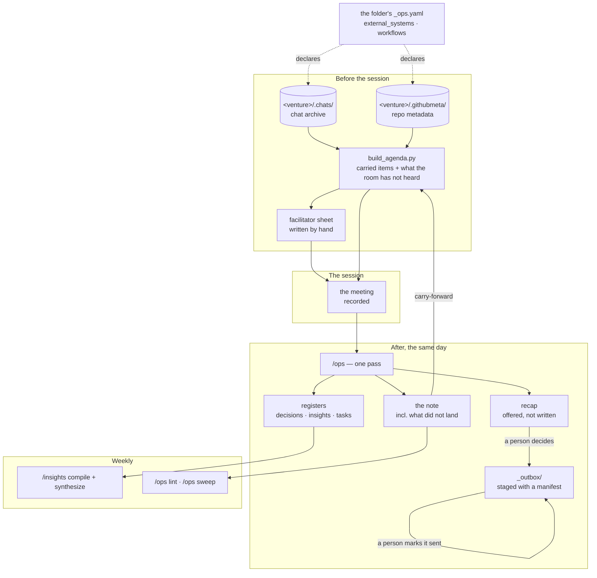

# core-skills

**Version:** 1.55.0

**[core-skills.doable.services](https://core-skills.doable.services)** — what it is, how a day fits together, install guide and FAQ.

Claude Code skills for operational documentation, transcript processing, task tracking, and team coordination — with a **knowledge loop** that compounds: every meeting feeds an insights corpus, confirmed patterns become standing rules for the skills, and the corpus is synthesized into a crosslinked knowledge wiki with a read-first index. Capture once; the system gets smarter and the knowledge stays readable.

**Releases:** [`CHANGELOG.md`](CHANGELOG.md) — 105 entries, newest first. This
file used to repeat the last 34 of them; it no longer does, because a second
copy of a changelog is a second thing to keep true.

## How a project runs



**The loop closes at the note.** What did not land in one session becomes the top
of the next agenda, carrying a session count and an age — so an item cannot
quietly outlive the series it belongs to.

**Three steps are deliberately manual**, marked above: the facilitator sheet,
deciding whether a recap is warranted, and marking a manifest sent. Each is a
place where generating the obvious answer would be confidently wrong in a way
the reader could not check.

## Why it is shaped this way

Four months of heavy production use taught us where document pipelines actually fail — and the v1.21–v1.26 wave restructured the suite around those findings. The suite now works as **four cooperating layers**:

### 0. Retrieval — what the room never said

A meeting record is built from a recording, so **everything asynchronous is invisible to it by
construction**: decisions posted to a chat, issues opened overnight, a document linked an hour before
the meeting. That is not an oversight anyone can be careful about — the loop has one input where the
work has three.

A folder declares the chat and the repositories its work concerns (`external_systems`); archivers write
them to `<venture>/.chats/` and `<venture>/.githubmeta/`; and the agenda generator **reads those
archives, never the network**. An agenda therefore renders with no credential and no connectivity, and
a declared read scope is honoured where the archiver recorded it. This layer runs **before** the
meeting, not after.

### 1. Capture — get everything in, safely

`/inbox` (universal capture — text, audio, and since v1.28 **file drops** with a pass-through lifecycle to their real home), `/transcript` and `/ops` (meetings), `/preparation` (pre-meeting). One door, one pending list: everything enters through `_inbox` and nothing lives there (`.ephemeral/` is the declared opposite — scratch with no vault destiny, allowed to die). This layer is guarded by a **name-safety chain** built up over three releases, because word-fidelity errors propagate into everything downstream:

- **CR-015** — undiarized transcripts (no speaker labels) fail safe: inferred action-item owners are written `?`/`Name?`, never confidently guessed.
- **CR-016** — proper nouns that match no known entity are flagged (`⚠ Namn att verifiera`) instead of committed; a plausible wrong name is worse than an honest question mark.
- **CR-017** — a **people roster** (`people:` in config) covers the long tail of recurring names, and a **committed-spelling check** compares every draft name against what the folder has already published — so one person can no longer end up spelled three ways across a meeting series, and a real-word mishearing can't silently replace an established domain term.

### 2. Structure — formats that can't silently fork

Formats used to erode by *template forking*: one deviating file re-seeds its whole series, and every later file looks internally consistent. Now every save is checked against a **template contract** (CR-018: heading order, action-table columns, empty-decision marker), `/ops lint` locates where an existing series forked, and the **slug contract** (CR-021) keeps filenames sortable and machine-readable. Deliberate format changes are made by editing the contract — an accidental fork becomes an explicit, reviewable decision.

### 3. Knowledge — insights that actually compound (loop closed in v1.31)

Every meeting silently accumulates durable insights (`_insights.yaml`); `/insights compile` promotes repeatedly-confirmed hypotheses to **rules** that are loaded back as context on future runs (CR-013), so the skills demonstrably get smarter in the folders you work in most. v1.21 (CR-020) hardened the loop: a write-time vocabulary guard stops schema drift at the source, `/insights normalize` migrates legacy files, and a `last_compiled` stamp makes a never-running synthesis loop visible instead of silent. v1.31 (CR-027) added the human-facing half: `/insights synthesize` renders the corpus into a **knowledge wiki** — crosslinked topic articles plus a master INDEX that sessions read first when answering knowledge questions, no RAG required.

### 4. Closure — the loop most systems never build

**Two kinds of closure, and the second was the late addition.** The first is folder-level rot. The
second is an item that never gets resolved *inside* a recurring series: a note ends with what did not
land, the next agenda is generated from it, and each item carries a session count **and an age** —
because a session is not a unit of time, and three sessions is three days on a daily series and two
months on a fortnightly one. Whichever threshold trips first, the agenda says so in itself. Owner is
read from a defined position and anything else reads `UNOWNED`, which is the finding rather than a parse
failure: an item nobody is named against is the one that falls through an agenda that lists it.

`/ops lint` walks that chain, because it holds the one failure in the loop that announces nothing — a
note missing its section produces a next agenda with zero carried items that **looks perfectly
correct**.

Append-only systems also rot quietly: indexes lag their folders, task ledgers freeze, sent material never gets archived, moved artifacts leave live-looking corpses, stray inbox/outbox folders quietly fork the pending list — and even the ecosystem's own components drift versions apart when their check has no scheduled reader. `/ops sweep` (CR-019, extended by CR-023/CR-025) detects all nine closure-debt classes in one read-only pass and offers the fixes (`/outbox archive --all-sent`, tombstones per the retirement convention, `/inbox triage refresh`, the alignment runbook, merge-or-exempt for structural strays); run it weekly and staleness stops accumulating.

### A project using the full set

The layers above say why the suite is shaped this way. This is the order they actually run in, for one
project with everything enabled.

**Once, at set-up.** Create the folder and its config. Declare four things and the rest follows:
`external_systems` (which chat, which repositories, and the read scope), `workflows.post_processing`
(which of the four post-meeting artifacts this series wants), `workflows.meeting_templates` (the shape
contract), and `workflows.task_ledger` — **`external` where the work already has a register elsewhere**,
which is how a project avoids growing a second ledger beside the real one.

**Before each session.** Archivers refresh the chat and repository archives — external CLIs, run on
demand, never by a skill. `build_agenda.py` then writes the agenda: carried items at the top with their
session count and age, then what the archives hold that the room has not heard. **The facilitator sheet
is written by hand** — the agenda carries facts, and turning a fact into the right question is
judgement, not generation.

**After each session, the same day.** Choose the transcript source: duplicates are the normal case, one
per capturing tool, so **list them and let a person pick** rather than choosing on their behalf. Then
`/ops` makes one pass — the summary, the registers, one changelog line — and Step 9 runs what the
project declared: tasks imported or routed to the external register, the slim priorities artifact for
the people doing the work, **the note's carry-forward section**, and **the recap offered rather than
written**.

**`/outbox` stages what goes out**, as a folder with a manifest. The manifest's status is the only
record that something was actually sent, and **a person advances it** — that click is where the posted
message gets read.

**Weekly.** `/insights compile` promotes confirmed hypotheses to rules; `/insights synthesize` renders
the wiki; `/ops lint` checks the shape contracts and the carry-forward chain; `/ops sweep` finds the
closure debt. `/daily-dashboard` runs whenever you want the day's view.

**When something belongs elsewhere.** `/outbox archive` files a resolved send into the recipient's
folder. `/handoff` freezes a bounded subject for a different piece of work — self-contained, indexed
nowhere, and moved only when a human opens it.

**Three steps are manual, and all three are deliberate:** the facilitator sheet, choosing between
duplicate sources, and asking before a recap. None is an unbuilt feature. Each is a place where
generating the obvious answer would be confidently wrong in a way the reader could not check.

### The triage surface — where the human stays in charge

CR-022 formalizes what heavy real-world use converged on: a single markdown **triage doc** in `_inbox/` — paste-fast capture, human-sorted buckets (INKORG → PRIO → DENNA VECKA → SENARE), a done-archive. The design principle is inverted from everything else: **skills adapt to the triage doc; the triage doc never adapts to skills.** Preps pull the relevant open items automatically, the dashboard surfaces today's priorities, task import can target it, and `/inbox triage refresh` does the mechanical upkeep — but sorting and wording remain entirely human. It earns its place by matching how people actually work: a low-ceremony habit outlives any structured file it replaces.

### The development loop around it all

The suite is developed **on live production data**: real usage generates evidence, evidence becomes CRs, CRs become releases. That loop has its own guardrails (CR-026): [`docs/RELEASING.md`](docs/RELEASING.md) codifies the one-way membrane between the private operating vault and this public repo — generic-by-construction writing, a private CR archive, and a **fail-closed pre-push guard** that scans every outgoing line against secret patterns and a private identifier denylist. Ecosystem components (the visualiser, the landing page) are held on the same version by an alignment check that `/ops sweep` reads on schedule (CR-023).

---

## Skills included

| Skill | Description | User-invocable |
|-------|-------------|----------------|
| `ops-base` | Shared operational framework (meeting formats, task management, workflows, archive policy). Base module referenced by other ops skills. | No |
| `ops-config` | Configuration system -- schema definition and base defaults for organization-specific settings. | No |
| `transcript` | Process and summarize transcriptions from calls, meetings, or voice recordings. Action-first canonical structure (Nästa steg → Beslut → Konklusion → Diskussion → Bakgrund). Three template variants by meeting length. Provides structured extraction for domain skills. Offers task import. Extracts durable insights to `_insights.yaml`. | Yes (`/transcript`) |
| `ops` | Unified meeting and operations processing -- config-driven for any organization. Subcommands: `/ops status` shows available org configs, `/ops prepare` creates pre-meeting preparation, `/ops normalize` restores Swedish characters (`--names` applies the people roster, `--filenames` fixes slug drift), `/ops lint` detects template forks in a meeting series, `/ops sweep` audits closure debt (stale indexes, ledgers, outbox, duplicates), `/ops help` shows usage guide. Extracts durable insights to `_insights.yaml`. Replaces project-ops, bravo-ops, management-ops, marketing-ops. | Yes (`/ops`) |
| `update-skills` | Skill repo management -- fetch/pull with version safety, symlink creation, health auditing, repo installation. Standalone. | Yes (`/update-skills`) |
| `daily-dashboard` | Daily meeting and task dashboard generator -- works generically from any vault or with org-specific config. Creates dashboard file and desktop symlinks. Integrates with task tracker. | Yes (`/daily-dashboard`) |
| `preparation` | Create meeting preparation documents with a 60-second walk-in agenda card on top and deep-dive content below the fold. Tagged questions ([DECISION]/[DEMO]/[STATUS]/[QUESTION]/[FYI]) instead of topic noun phrases. Mandatory cross-reference scan with explained relevance. Frozen at meeting time -- no mid-meeting edits. | Yes (`/preparation`) |
| `tasks` | Personal task tracker with cross-project correlation. Central task index, source linking, automatic carry-forward, privacy model. | Yes (`/tasks`) |
| `insights` | Knowledge extraction manager and skill evolution engine. Backfills `_insights.yaml`, compiles execution feedback into patterns (hypothesis → rule lifecycle with `last_compiled` freshness stamp), migrates drifted files to the current schema, **synthesizes the corpus into a knowledge wiki** (topic articles + read-first INDEX, CR-027), proposes SKILL.md improvements. Subcommands: `reprocess`, `scan-claude-md`, `compile`, `normalize`, `synthesize`, `propose`, `status`, `help`. | Yes (`/insights`) |
| `inbox` | Universal entry point for unstructured content. Classifies voice memos, quick notes, emails, raw text **and file drops** (`_inbox/.files/`, CR-024 — the source file moves with its output to the target's `.attachments/`) and routes to the appropriate downstream skill (`/transcript`, `/ops`, `/tasks`). Stores in `_inbox/` with web UI support. Also maintains the **triage working surface** (CR-022): `/inbox triage refresh` does mechanical upkeep of a human-owned daily triage doc (week anchor, done-archive, aging report) without ever reordering or rewording it. | Yes (`/inbox`) |
| `md2pdf` | Convert markdown files to styled PDFs. Supports Mermaid diagrams (rendered as PNG), tables, professional A4 typography. Individual or combined output. `--outbox NAME` packages PDFs into `<vault>/_outbox/YYMMDD-NAME/` with auto-generated manifest and email stub. | Yes (`/md2pdf`) |
| `analytics` | Vault-level content analytics -- file creation trends, skill adoption, contact engagement, content distribution, unprocessed backlog detection. Analyses file metadata (names, dates, paths), not contents. Outputs to `_analytics/` folder. Subcommands: `overview`, `skills`, `contacts`, `pipeline`, `backlog`, `help`. | Yes (`/analytics`) |
| `outbox` | Lifecycle management for `<vault>/_outbox/`. Lists pending/resolution-ready items by reading each `_manifest.md`; archives resolved folders into the relevant `_contacts/<contact>/YYMMDD-<theme>/` while updating manifest, CHANGELOG, and `_tasks.yaml` source paths. Subcommands: `list`, `status`, `archive <folder>`, `archive --all-sent` (batch), `help`. | Yes (`/outbox`) |
| `handoff` | Frozen context snapshots in `<vault>/.handoff/`. Captures one bounded subject from a conversation as a self-contained document a different work session can pick up cold — no vault links, no index entry, no task generated. **Nothing in the suite picks it up: a human opens it and starts new work.** Carries an explicit confidentiality boundary when the source was confidential, so the constraint travels with the content. Subcommands: `list`, `read <name>`, `help`. | Yes (`/handoff`) |

## Shared contract: `ecosystem.yaml`

[`ecosystem.yaml`](ecosystem.yaml) is the single source of truth for the suite. Marvin (formerly core-skills-visualisation), the landing page, Trillian (vault-pulse), and any future external tools should read it instead of hard-coding skill lists, schema versions, or vault file paths.

It declares:

- **Schema versions** -- `ops_config`, `contact_meta`, `tasks`, `insights`
- **Insight type enums** -- content vs evolution
- **Contact classification** -- levels, defaults, folder pattern defaults (CR-009)
- **Skills registry** -- user-invocable + non-invocable, with badges and subcommands
- **`vault_conventions`** (CR-010, contract_version >= 2) -- authoritative declaration of every file the suite produces or consumes in a user's vault. Each entry documents path pattern, purpose, schema link, writers, readers, and lifecycle. Three sections: `vault_root`, `per_folder`, and cross-cutting `rules` (vault-relative paths, single inbox/outbox, config resolution order, naming, audio/transcript pairing).
- **Visualisation features** -- the page list Marvin renders

The contract is versioned (`contract_version: 7`). Bumps are additive when possible -- older clients ignore unknown blocks; newer clients get the additional structured declarations. Run [`scripts/check-ecosystem-alignment.sh`](scripts/check-ecosystem-alignment.sh) after editing to verify Marvin's CLAUDE.md and the landing page reference the same `core_skills_version`.

## Architecture

Skills are **organization-agnostic**. They use a layered configuration system (rewritten in v1.16.0 -- CR-011):

1. **Project-level** (`.claude/ops-config.yaml`) -- overrides for specific projects
2. **Folder-local** (`<vault>/<org>/_ops.yaml`) -- per-org config, walked up from CWD until vault root
3. **Vault-wide** (`<vault>/_config/base.yaml`, optional) -- overrides shared across all folders
4. **Base defaults** (`~/.claude/skills/ops-config/base.yaml`) -- fallback values

Pre-v1.16.0 chain (`~/.claude/skills/{org}-ops-config/{org}.yaml`) is deprecated, removed in v1.17.0. See CHANGELOG `[1.16.0]` `### Migration` for one-time migration steps.

The project's `CLAUDE.md` remains the single source of truth for vault-specific details (folder structure, meeting routing, file naming conventions).

### Configuration

Domain skills read from their org config for:
- `language`: Output language (english/swedish/input)
- `team`: Participant recognition and attribution
- `responsibility_matrix`: Owner assignments
- `terminology`: Domain-specific terms
- `workflows`: Which files to update, action propagation, post-processing (task import, dashboard refresh), knowledge extraction, verticals

As of v1.16.0 (CR-011), org configs live in `<vault>/<org>/_ops.yaml` -- co-located with the content they describe. This repo provides `base.yaml` as fallback and `schema.md` as the schema definition.

### Skill dependencies

```
core-skills (this repo)
  ops-config (schema + base defaults)
  ops-base (shared standards) <-- reads config
    +-- ops (extends ops-base, config-driven, replaces all domain ops skills)
  transcript (extraction layer) --> offers task import, writes _insights.yaml
  preparation (standalone -- meeting preparation)
  daily-dashboard (standalone -- generic + org mode) <-- reads _tasks.yaml
  tasks (standalone -- personal task tracker) <-- writes _tasks.yaml
  update-skills (standalone -- repo management)
  insights (standalone -- extraction manager + evolution engine) --> reads transcripts + CLAUDE.md, writes _insights.yaml, compiles patterns, proposes SKILL.md changes
  analytics (standalone -- vault metrics) --> reads file metadata (names, dates, paths), writes _analytics/
  inbox (standalone -- universal capture) --> classifies + routes to transcript/ops/tasks
```

`/ops` is config-driven: behaviour changes based on org config (`bravo-ops-config`, `acme-ops-config`, etc.) and project-level overrides. Organization configs live in separate repos.

---

## Skill Comparison

### Overview

| Skill | Organization | Language | Files Updated | Domain Focus |
|-------|--------------|----------|---------------|--------------|
| `transcript` | Any | Input language | 1-2 + tasks + insights | Generic extraction |
| `ops` | Any (config-driven) | Per config | Per config (1-5) + insights | Meetings, standups, ops |
| `update-skills` | Any | English | 0 (manages symlinks/repos) | Skill repo management |
| `daily-dashboard` | Any | Swedish/per config | 1 + symlinks | Meeting/task dashboard |
| `preparation` | Any | Swedish/input | 1-2 | Meeting preparation |
| `tasks` | Any | Input language | 2 (_tasks.yaml + history) | Personal task tracking |
| `insights` | Any | Input language | _insights.yaml (per folder) | Retroactive knowledge extraction |
| `analytics` | Any | Swedish/input | _analytics/ (snapshots) | Vault-level content metrics |
| `inbox` | Any | Input language | _inbox/ (capture + classify) | Universal content capture |
| `outbox` | Any | Input language | _outbox/ + _contacts/<contact>/ | Outgoing material lifecycle |

Organization-specific skills extend `ops-base` and live in their own repos.

### What They Share (via ops-base)

All domain skills inherit from `ops-base`:

- **Priority system:** P0 (critical) through P3 (research)
- **Status indicators:** BLOCKED, IN PROGRESS, ON TRACK, TODO, COMPLETE
- **Meeting formats:** Two-tier summary (Concise vs Detailed Strategic)
- **Template contracts (CR-018):** per-meeting-type shape contracts checked before every save -- heading order, action-table columns, empty-decision marker. Format changes happen by editing the contract, never by silent drift.
- **Task lifecycle:** Creation > Active > Post-meeting > Archive
- **CHANGELOG format:** Standardized entry structure
- **Archive policy:** Never delete, always archive to `.archive/`
- **Retirement convention (CR-019):** relocating any living artifact leaves a tombstone pointer at the old path -- migrations never leave live-looking corpses
- **Slug contract (CR-021):** filenames keep å/ä/ö, always `YYMMDD-` prefixed, always carry a machine-readable role keyword
- **Cross-referencing:** Link standards for meetings, tasks, changelogs

### Skill Details

#### transcript (standalone)

- **Purpose:** Universal extraction layer
- **Output:** Single summary file + CHANGELOG, `_insights.yaml` (knowledge extraction)
- **Format (CR-006, v1.15.3):** Action-first canonical structure -- Nästa steg → Beslut → Konklusion → Diskussion → Bakgrund. Beslut section is mandatory (write `*(Inga formella beslut)*` if empty). 5-column action item table. Three template variants by meeting length (Concise / Standard / Extended).
- **Special:** Provides structured YAML extraction for domain skills. Step 3.5 silently extracts durable insights (decisions, preferences, learnings, opportunities, patterns) to `_insights.yaml`.
- **Operations:** `/transcript [content]` (paste text or provide file path), `/transcript --concise`, `/transcript --extended`
- **Use when:** Processing any transcript without domain-specific formatting

#### ops (config-driven)

- **Purpose:** Unified meeting and operations processing
- **Output:** Configurable -- summary only (default), or up to 5 files (summary, CHANGELOG, README, task-priority-matrix, meetings/README), plus optional post-processing (task import to `_tasks.yaml`, dashboard refresh), plus `_insights.yaml` (knowledge extraction)
- **Config-driven:** Summary sections, status terms, domain additions, action propagation, agenda management, post-processing, knowledge extraction, verticals all controlled by org config
- **Replaces:** project-ops, bravo-ops, management-ops, marketing-ops
- **Operations:** `/ops [content]` (default), `/ops prepare [type]`, `/ops normalize <path>` (CR-007 -- restore Swedish characters; `--names` applies the people roster, CR-017; `--filenames` fixes slug drift, CR-021), `/ops lint <folder>` (CR-018 -- find where a meeting series' format forked), `/ops sweep` (CR-019/023/025 -- read-only closure/staleness audit across nine debt classes), `/ops status`, `/ops help`
- **Use when:** Any meeting type -- standups, management meetings, marketing reviews, business syncs. The default choice -- use `/transcript` only when you explicitly don't want org config machinery.

#### update-skills (standalone)

- **Purpose:** Skill repo management and maintenance
- **Output:** No files created in projects -- manages symlinks and git state
- **Operations:** update, status, check, install
- **Special:** Multi-remote version safety (ancestor check before pull), symlink health auditing, auto-discovery of repos via symlink scanning
- **Use when:** Updating skills to latest, setting up a new machine, checking symlink health, installing new skill repos

#### daily-dashboard (standalone)

- **Purpose:** Daily meeting and task dashboard generation
- **Output:** `_Dashboard.md` file + desktop symlinks (`_PREP-*`, `_TODAY-*`, and `_MGMT-*`/`_MKT-*` in org mode)
- **Operations:** `[org] [today|tomorrow|YYMMDD]` -- generic mode (scan cwd) or org mode (load config)
- **Special:** Two modes -- generic (scans `_contacts/` folders for dated files) and org mode (loads `<vault>/<org>/_ops.yaml` for project-specific discovery, CR-011). Discovers preparations and transcripts automatically by filename pattern.
- **Use when:** Starting your day, preparing for meetings, need quick access to today's files

#### preparation (standalone)

- **Purpose:** Structured meeting preparation from contact history, optimised for walk-in usability
- **Output:** `YYMMDD-förberedelse-*.md` file (optionally CHANGELOG)
- **Operations:** `<contact name> [date]`
- **Format (CR-005, v1.15.2):** Two-tier structure -- 60-second walk-in card on top (agenda + open actions), deep dives below the fold separated by a horizontal rule. Agenda items use a 5-tag system (`[DECISION]`/`[DEMO]`/`[STATUS]`/`[QUESTION]`/`[FYI]`, Swedish: BESLUT/DEMO/STATUS/FRÅGA/FYI) and must be questions or deliverables, not noun phrases. Maximum 5 items in the walk-in card -- prioritised by criticality.
- **Special:** Step 0 frozen-prep check refuses mid-meeting edits to past-dated prep files. Step 2.5 cross-reference scan is mandatory with explained relevance -- bare links forbidden. Single-document principle: a prep file may not require reading another prep file. Background moves to bottom (reference, not navigation). Bidirectional supersede linkage when `/ops` processes the meeting transcript.
- **Use when:** Preparing for an upcoming call or meeting with a contact

#### tasks (standalone)

- **Purpose:** Personal task tracking with cross-project correlation
- **Output:** `_tasks.yaml` (active tasks), `_tasks-history.md` (completed log)
- **Operations:** `show`, `add`, `done`, `import`, `weekly`, `archive`, `migrate`
- **Special:** Central index at vault parent, source linking to meetings, privacy model (`private: true/false`), project tagging, automatic carry-forward. Integrates with `/transcript` (import) and `/daily-dashboard` (display).
- **Use when:** Tracking action items from meetings, managing personal tasks across projects, reviewing weekly progress

#### insights (standalone)

- **Purpose:** Retroactive knowledge extraction from existing corpus + the compile half of the knowledge loop
- **Output:** `_insights.yaml` (per folder, same format as transcript Step 3.5)
- **Operations:** `reprocess [target]`, `scan-claude-md`, `compile`, `normalize [path] [--apply]` (CR-020 -- migrate drifted/legacy files to the current schema, dry-run default), `propose`, `propose apply`, `status`, `help`
- **Special:** Backfills insights from historical transcripts and CLAUDE.md files. Dedup by `source.file` -- safe to run repeatedly. Does not duplicate extraction logic -- references `/transcript` Step 3.5 as authoritative source. `compile` runs the CR-013 lifecycle (hypothesis → rule promotion, contradiction demotion) and stamps `last_compiled` so synthesis staleness is detectable (CR-020). Names are allowed in entries; prefer name-free summaries when an insight generalizes (CR-020 reusability note).
- **Use when:** Setting up insights for a folder that predates the knowledge extraction feature, extracting embedded knowledge from CLAUDE.md files, running the periodic compile pass, or migrating pre-schema insight files

#### analytics (standalone)

- **Purpose:** Vault-level content analytics — longitudinal trends, not daily snapshots
- **Output:** `_analytics/YYMMDD-*.md` snapshot files (overview, skill-adoption, contact-engagement, backlog-report)
- **Operations:** `overview` (default), `skills`, `contacts`, `backlog`, `help`
- **Special:** Reads file metadata only (names, dates, paths) — never file contents. Path-first classification avoids keyword miscount. Privacy-aware via `_meta.yaml`. Historical snapshots archived automatically.
- **Use when:** Understanding vault growth trends, tracking skill adoption, analysing contact engagement patterns, finding unprocessed content

#### outbox (standalone, v1.16.3)

- **Purpose:** Lifecycle management for outgoing material staged in `<vault>/_outbox/`
- **Output:** No new files -- moves outbox folders into `_contacts/<contact>/YYMMDD-<theme>/` and updates manifest, CHANGELOG, `_tasks.yaml`
- **Operations:** `list` / `status` (default -- classifies items as PENDING / RESOLUTION-READY / DRAFT / WITHOUT MANIFEST), `archive <folder>` (move + update references), `archive --all-sent` (CR-019 -- batch-archive every sent item, selection confirmed up front), `help`
- **Special:** Reads `_manifest.md` as canonical state file -- an item is "resolution-ready" when `Status: skickad ...` AND all `Svar förväntas på` are checked AND `Utfall` is populated. Strips the contact-name prefix from the folder name when archiving (it's redundant inside the contact's own folder). Multi-contact fan-out (ambassador-style) prompts the user for duplicate-vs-shared-archive strategy. Never auto-completes tasks. Searches vault for stray references to the old path and rewrites them.
- **Use when:** An outbox item has been sent, replied to, and resolved -- and the central `_outbox/` should be cleaned up. Or use `list` to audit what's pending.

### Workflow Comparison

```
transcript:       Input -> Summary -> CHANGELOG -> (knowledge extraction -> _insights.yaml)
                                 -> (offer task import)

ops:              Input -> Summary -> (per config: CHANGELOG, README, task matrix, meetings index)
                                   -> (knowledge extraction -> _insights.yaml)
                                   -> (per config: action propagation, agenda management)
                                   -> (per config: task import to _tasks.yaml, dashboard refresh)
                                   -> (per config: check verticals -- suggest updates to living documents)

ops status:       /ops status -> scan <vault>/*/_ops.yaml -> report active + available configs

ops lint:         /ops lint <folder> -> check files vs template contracts -> report series forks by date

ops sweep:        /ops sweep -> 9 closure-debt checks (indexes, ledgers, corpses, outbox,
                               duplicates, residue, triage, contract alignment,
                               structure conformance) -> report + offered fixes

ops help:         /ops help -> print usage guide with skill correlation

update-skills:    /update-skills         -> fetch -> ancestor check -> pull -> symlink new
                  /update-skills status   -> scan repos + symlinks -> report
                  /update-skills check    -> audit symlinks -> report -> offer fixes
                  /update-skills install  -> clone -> add remotes -> symlink all

daily-dashboard:  /daily-dashboard              -> generic: scan cwd for dated files -> dashboard
                  /daily-dashboard acme      -> org mode: load config -> project discovery -> dashboard
                  /daily-dashboard YYMMDD       -> specific date dashboard + symlinks
                  (all modes)                   -> read _tasks.yaml -> display in Teamfokus

preparation:      /preparation david           -> find _contacts/david-*/ -> read history -> ask context -> generate briefing
                  /preparation erik 260219    -> specific contact + date -> preparation document

insights:         /insights reprocess _contacts/bob-smith -> read transcripts -> extract insights -> _insights.yaml
                  /insights reprocess all       -> scan all CHANGELOG.md folders -> batch extract
                  /insights reprocess since YYMMDD -> date-filtered batch extract
                  /insights scan-claude-md      -> scan CLAUDE.md files -> extract knowledge -> _insights.yaml
                  /insights compile             -> read edge_case/correction entries -> find patterns -> skill_pattern
                                                   + hypothesis→rule promotion + last_compiled stamp
                  /insights compile since YYMMDD -> compile only recent feedback
                  /insights normalize [--apply] -> migrate drifted/legacy _insights.yaml to current schema (dry-run default)
                  /insights synthesize [topic]  -> cluster corpus semantically -> wiki articles + INDEX.md (read-first, no RAG)
                  /insights propose             -> read skill_patterns -> generate SKILL.md proposals
                  /insights propose apply       -> apply proposal -> update SKILL.md + CHANGELOG
                  /insights status              -> scan _insights.yaml files -> report counts + evolution stats
                  /insights help                -> print usage guide

tasks:            /tasks                        -> show active tasks grouped by project/priority
                  /tasks add "description"      -> interactive task creation
                  /tasks done 5                 -> mark task complete -> move to history
                  /tasks import meeting.md      -> extract action items -> add to _tasks.yaml
                  /tasks weekly                 -> generate weekly review (completed, carried, blocked)

analytics:        /analytics                    -> vault overview (default)
                  /analytics overview           -> file counts, growth, distribution, busiest dates
                  /analytics skills             -> skill adoption over time, structured vs unstructured ratio
                  /analytics contacts           -> contact engagement timelines, network growth
                  /analytics pipeline           -> input -> meeting docs -> outcomes chain, ratios, per-day averages
                  /analytics backlog            -> unprocessed .txt files, missing insights, stale inbox
                  /analytics help               -> print usage guide
```

### Choosing the Right Skill

**Rule of thumb:** Use `/ops` for any meeting that belongs to a project or organization. Use `/transcript` for personal calls and ad-hoc recordings without an org context. When in doubt, use `/ops` -- it falls back gracefully when no config exists.

| Scenario | Skill |
|----------|-------|
| Meeting with org config (Acme, Bravo, etc.) | `/ops` |
| Standup, weekly sync, board meeting | `/ops` |
| Personal call, no org context | `/transcript` |
| Ad-hoc voice recording, quick summary only | `/transcript` |
| See what org configs are available | `/ops status` |
| Learn how /ops works and relates to other skills | `/ops help` |
| Prepare before a meeting | `/preparation` |
| Track action items across projects | `/tasks` |
| Review weekly task progress | `/tasks weekly` |
| Daily overview with meeting links and tasks | `/daily-dashboard` |
| Answer a knowledge question ("what have I learned about X?") | Read `.knowledge/INDEX.md` first, then only the relevant wiki article(s) |
| Render the insights corpus into wiki articles + index | `/insights synthesize` |
| Backfill insights for existing transcripts | `/insights reprocess` |
| Extract knowledge from CLAUDE.md files | `/insights scan-claude-md` |
| Check insight coverage across vault | `/insights status` |
| Compile execution feedback into patterns | `/insights compile` |
| Generate skill improvement proposals | `/insights propose` |
| Apply a skill improvement proposal | `/insights propose apply` |
| Update skills, check symlinks, install repos | `/update-skills` |
| Quick capture of unstructured content | `/inbox` |
| Drop a file (PDF/CSV/media) for processing into the vault | `/inbox <file path>` (lands in `_inbox/.files/`) |
| Park disposable scratch that should never enter the vault | `.ephemeral/` (swept after 14 days) |
| Find stray/variant inbox-outbox folders in the tree | `/ops sweep` (check 9) |
| Don't know which skill to use | `/inbox` (classifies and routes for you) |
| See what's pending in the outbox | `/outbox list` |
| Archive a sent-and-replied outbox folder into the contact folder | `/outbox archive <folder>` |
| Batch-archive everything already sent | `/outbox archive --all-sent` |
| Audit the vault for staleness and closure debt | `/ops sweep` |
| Find where a recurring meeting's format silently forked | `/ops lint <folder>` |
| Refresh the daily triage doc (week anchor, done-archive) | `/inbox triage refresh` |
| Migrate old/drifted `_insights.yaml` files to the current schema | `/insights normalize` |
| Apply the canonical-name roster to a folder's files | `/ops normalize --names <folder>` |
| Fix Swedish-character drift in filenames | `/ops normalize --filenames <folder>` |
| Restore Swedish characters in hand-written docs | `/ops normalize <path>` |
| See vault-wide content trends and growth | `/analytics overview` |
| Understand which skills produce the most content | `/analytics skills` |
| See contact engagement frequency and timelines | `/analytics contacts` |
| Find unprocessed transcriptions or insight gaps | `/analytics backlog` |

### Daily Workflow Guide

A typical workday using the skill ecosystem. All steps are optional -- use what fits.

```
  MORNING                    BEFORE MEETING              MEETING              AFTER MEETING                 ONGOING
  ───────                    ──────────────              ───────              ─────────────                 ───────

  /daily-dashboard           /preparation <contact>      [Record/            /ops [transcript]             /tasks show
       │                          │                       take notes]        or /transcript [text]         /tasks done N
       ▼                          ▼                                               │
  Review today's             Briefing with context,                               ├── knowledge extraction
  meetings, tasks,           open items, agenda                                   │   -> _insights.yaml
  preparations               from previous calls                                  ├── task import offered
                                                                                  ├── preparation marked
                                                                                  │   superseded
                                                                                  └── dashboard refresh
                                                                                      (if configured)
```

#### Morning -- start of day

| Step | Skill | What you get |
|------|-------|-------------|
| 1 | `/daily-dashboard` (or `/daily-dashboard <org>`) | Overview: today's meetings, preparations, active tasks, quick-access symlinks |

#### Before each meeting

| Step | Skill | What you get |
|------|-------|-------------|
| 2 | `/preparation <contact> [date]` | Briefing with context from previous calls, open action items, suggested agenda, cross-references from other contacts |

#### After each meeting

| Step | Skill | When to use |
|------|-------|-------------|
| 3a | `/ops [transcript]` | Org meetings (standups, syncs, reviews) -- full processing with config-driven file updates |
| 3b | `/transcript [transcript]` | Personal calls, ad-hoc recordings -- lightweight summary |
| 3c | `/engagement-ops [content]` | Consulting engagements -- phase-aware documentation (bravo-skills) |
| 4 | Accept task import (offered by 3a/3b) | Action items flow into `_tasks.yaml`, show up in tomorrow's dashboard |

#### Throughout the day

| Skill | When |
|-------|------|
| `/tasks show` | Check what needs doing |
| `/tasks done N` | Mark completed items |
| `/tasks add "description"` | Capture ad-hoc tasks |
| `/cr create "title"` | Track a change request (bravo-skills) |

#### Connections that happen automatically

- `/daily-dashboard` discovers preparations and meeting files by filename pattern
- `/ops` marks earlier preparations as superseded
- `/ops` can refresh the dashboard after processing (when `post_processing.dashboard_refresh` is enabled)
- Both `/ops` and `/transcript` offer to import action items into `_tasks.yaml`
- Both `/ops` and `/transcript` silently extract durable insights to `_insights.yaml` (decisions, preferences, learnings, opportunities, patterns)
- `/daily-dashboard` reads `_tasks.yaml` and shows tasks in the "Teamfokus" section
- `/ops` checks configured verticals (living topic-longitudinal documents) for topic matches and suggests updates
- `/preparation` Step 2.5 scans other contact folders for **lateral** cross-references (last 60 days, mandatory with explained relevance per CR-005)
- `/preparation` Step 0 refuses to mutate prep files dated in the past -- mid-meeting notes go in the transcript file
- `/ops` writes a `*Preparation: [link]*` back-link in the meeting summary footer when superseding a prep file (bidirectional traceability per CR-005)

### Quick Start: After a Meeting

| You have... | Run | What happens |
|-------------|-----|-------------|
| Transcript from a Acme management meeting | `/ops [paste transcript]` | Summary in meetings/management/, CHANGELOG, task import, dashboard refresh |
| Notes from a marketing standup | `/ops [paste notes]` | Summary in meetings/marketing/, CHANGELOG updated |
| Recording from a personal call (no org) | `/transcript [paste transcript]` | Summary file + CHANGELOG in target folder |
| Nothing yet -- meeting is tomorrow | `/preparation david` | Briefing with context from previous conversations |
| Morning -- need today's agenda | `/daily-dashboard acme` | Dashboard with meetings, tasks, quick-access links |

### How Skills Work Together

#### Complete Skill Interaction Diagram

```
┌─────────────────────────────────────────────────────────────────────────────┐
│                           SKILL INTERACTION MAP                              │
└─────────────────────────────────────────────────────────────────────────────┘

                              ┌──────────────┐
                              │  ops-config  │
                              │  (base.yaml) │
                              └──────┬───────┘
                                     │ provides defaults
                                     ▼
┌─────────────┐              ┌──────────────┐              ┌─────────────┐
│ preparation │──creates────▶│    Files     │◀────creates──│  transcript │
│             │              │              │              │  (lightweight│
│ YYMMDD-     │              │ _contacts/*/ │              │  no config) │
│ förberedelse│              │ meetings/    │              └──────┬──────┘
└─────────────┘              └──────┬───────┘                    │
                                    ▲                            │ writes
                                    │ creates (summary, CHANGELOG,│
                                    │ README, task matrix,        ▼
                                    │ meetings index)    ┌────────────────┐
                              ┌─────┴────────┐  writes   │ _insights.yaml │  writes
                              │     /ops     │─────────▶│ (per folder)   │◀─────────┐
                              │ (config-     │           └────────────────┘          │
                              │  driven)     │                  ▲              ┌─────┴────────┐
                              └──┬───────┬───┘                  │ writes       │  /insights   │
                                 │       │                      │              │  (backfill + │
                                 │       │                /transcript          │  CLAUDE.md)  │
                                 │       │                (Step 3.5)           └──────────────┘
                    task import  │       │  dashboard refresh
                                 ▼       ▼
                         ┌──────────────┐  ┌─────────────────┐
                         │    tasks     │  │ daily-dashboard │
                         │              │  │                 │
                         │ _tasks.yaml  │──▶ _Dashboard.md  │
                         │ _tasks-      │  └────────┬────────┘
                         │ history.md   │           │
                         └──────────────┘           │ creates
                                                    ▼
                                           ┌─────────────────┐
                                           │    Symlinks     │
                                           │ _TODAY-*, etc.  │
                                           └─────────────────┘

                                           ┌─────────────────┐
                                           │  /analytics     │
                                           │                 │
                                           │ reads ALL file  │
                                           │ metadata (names,│
                                           │ dates, paths)   │
                                           │                 │
                                           │ writes:         │
                                           │ _analytics/*.md │
                                           └─────────────────┘

Data Flow:
  ─────▶  creates/writes
  ──────▶ reads
  ─ ─ ─▶  optional (per config)
```

#### Meeting + Task Lifecycle (State Diagram)

```
┌─────────────────────────────────────────────────────────────────────────────┐
│                        MEETING + TASK LIFECYCLE                              │
└─────────────────────────────────────────────────────────────────────────────┘

State 1: PREPARATION
┌──────────────────────────────────────────────────┐
│ /preparation david                              │
│                                                  │
│ Input: Contact name + date                       │
│ Reads: Previous transcripts, CHANGELOG           │
│ Output: YYMMDD-förberedelse-*.md                │
│                                                  │
│ Dashboard: Shows in "Förberedelser" section     │
└──────────────────────────────────────────────────┘
                         │
                         ▼
                  [Meeting happens]
                         │
                         ▼
State 2a: /OPS (primary -- any org meeting)
┌──────────────────────────────────────────────────┐
│ /ops [content]                                   │
│                                                  │
│ Input: Transcript or notes                       │
│ Creates: Summary + per-config files              │
│   (CHANGELOG, README, task matrix, meetings idx) │
│ Post-processing: Task import + dashboard refresh │
│                                                  │
│ Dashboard: Shows in "Samtal/Möten" section       │
└──────────────────────────────────────────────────┘

State 2b: /TRANSCRIPT (lightweight -- personal/ad-hoc)
┌──────────────────────────────────────────────────┐
│ /transcript [content]                            │
│                                                  │
│ Input: Transcription text                        │
│ Creates: YYMMDD-samtal-*.md + CHANGELOG           │
│ Offers: Task import (Step 4)                     │
│                                                  │
│ Dashboard: Shows in "Samtal" (preparation hidden)│
└──────────────────────────────────────────────────┘
                         │
          ┌──────────────┴──────────────┐
          │                             │
          ▼                             ▼
State 3a: TASK IMPORT              State 3b: NO TASKS
┌─────────────────────┐            ┌─────────────────────┐
│ User accepts import │            │ User declines       │
│                     │            │                     │
│ Action items ->     │            │ Lifecycle ends      │
│ _tasks.yaml         │            │ (for this meeting)  │
│                     │            │                     │
│ Source: transcript  │            └─────────────────────┘
│ Status: pending     │
└─────────────────────┘
          │
          ▼
State 4: TASK TRACKING
┌──────────────────────────────────────────────────┐
│ /tasks (ongoing)                                 │
│                                                  │
│ /tasks show        - View active tasks           │
│ /tasks done N      - Complete task -> history    │
│ /tasks weekly      - Review progress             │
│                                                  │
│ Dashboard: Shows in "Teamfokus" section          │
└──────────────────────────────────────────────────┘
          │
          ▼
State 5: DASHBOARD VIEW
┌──────────────────────────────────────────────────┐
│ /daily-dashboard                                 │
│                                                  │
│ Aggregates:                                      │
│ - Meetings (from YYMMDD-*.md files)             │
│ - Tasks (from _tasks.yaml)                       │
│ - Completed (from _tasks-history.md)             │
│ - Priority links (from project matrices)         │
│                                                  │
│ Output: _Dashboard.md + symlinks                 │
└──────────────────────────────────────────────────┘
```

#### Data File Relationships

```
Vault Parent Directory (e.g., ~/Documents/User/)
│
├── _Dashboard.md              <- /daily-dashboard (generic)
├── _Dashboard-acme.md      <- /daily-dashboard acme
├── _tasks.yaml                <- /tasks, /ops (import), /transcript (import)
├── _tasks-history.md          <- /tasks done
├── _analytics/                <- /analytics (snapshots)
│   ├── YYMMDD-vault-overview.md
│   ├── YYMMDD-skill-adoption.md
│   ├── YYMMDD-contact-engagement.md
│   ├── YYMMDD-backlog-report.md
│   └── .archive/              <- older snapshots
│
├── acme/                   <- Project vault
│   ├── meetings/
│   │   ├── board/
│   │   │   └── 260220-samtal-Alex-Frank.md  <- /transcript
│   │   ├── management/
│   │   │   ├── 260224-Acme-Weekly-Management-Meeting.md  <- /ops
│   │   │   ├── CHANGELOG.md                                 <- /ops
│   │   │   └── _insights.yaml                               <- /ops, /transcript, /insights
│   │   └── marketing/
│   │       └── 260225-Grace-Alex-ppc-review.md              <- /ops
│   ├── ops/
│   │   └── management/
│   │       ├── priority-matrix.md   <- /ops
│   │       └── README.md            <- /ops
│   └── README.md                    <- /ops (meetings index)
│
└── _contacts/                  <- Contact folders
    └── david-ekberg/
        ├── 260220-förberedelse-samtal-Alex-David.md  <- /preparation
        ├── 260220-samtal-Alex-David.md               <- /transcript
        ├── CHANGELOG.md                                 <- both skills
        └── _insights.yaml                               <- /ops, /transcript, /insights
```

#### File discovery

`/daily-dashboard` finds files by scanning for `YYMMDD-*.md` patterns:

| Filename contains | Dashboard section | Produced by |
|-------------------|-------------------|-------------|
| `förberedelse` / `preparation` | Förberedelser | `/preparation` |
| `standup` / `daily-standup` | Standup/Projekt | `/ops` |
| Anything else (`samtal`, etc.) | Samtal/Möten | `/transcript`, `/ops` |

**Generic mode:** Scans cwd recursively. Works with `_contacts/` folders and `meetings/` directories.
**Org mode:** `/daily-dashboard acme` loads org config for project-specific paths and persistent symlinks.

#### Task flow

```
Source               Skill              Storage              Display
──────               ─────              ───────              ───────

Meeting          /transcript           _tasks.yaml      /daily-dashboard
action items  ───────────────────▶   (active tasks)  ─────────────────▶  Teamfokus
                   Step 4                                                 section

Meeting          /ops                  _tasks.yaml      /daily-dashboard
action items  ───────────────────▶   (active tasks)  ─────────────────▶  Teamfokus
                   Step 9                                                 section

Manual           /tasks add            _tasks.yaml      /daily-dashboard
entry        ───────────────────▶   (active tasks)  ─────────────────▶  Teamfokus
                                                                          section

Task             /tasks done        _tasks-history.md  /daily-dashboard
completion   ───────────────────▶   (append-only)   ─────────────────▶  Slutfört
                                                                         section
```

Note: `/ops` Step 9 can also trigger `/daily-dashboard` refresh automatically when `post_processing.dashboard_refresh` is enabled in the org config.

```
Knowledge Extraction (silent -- runs alongside task flow):

Source               Skill              Storage                     Display
──────               ─────              ───────                     ───────

Meeting          /transcript           _insights.yaml          core-skills-
summary      ───────────────────▶   (per folder,             visualisation
                   Step 3.5          alongside CHANGELOG)  ─────▶  /insights
                                                                    page
Meeting          /ops                  _insights.yaml
summary      ───────────────────▶   (per folder,
                   Step 5.5          alongside CHANGELOG)

Existing         /insights             _insights.yaml
transcripts  ───────────────────▶   (per folder,
                   reprocess         alongside CHANGELOG)

CLAUDE.md        /insights             _insights.yaml
files        ───────────────────▶   (per folder,
                   scan-claude-md    alongside CHANGELOG)
```

Knowledge extraction is deduped by source file, threshold-based (skips trivial conversations), and limited to 10 insights per meeting. `/insights reprocess` backfills from existing transcripts; `/insights scan-claude-md` extracts from CLAUDE.md files. `_insights.yaml` files are never read by any skill -- only by the visualisation app.

#### Config-driven strings

Section headers, annotations (`[UTFALL]`), and metadata labels are configurable via ops-config:

```yaml
# In your org config (e.g. acme.yaml):
strings:
  annotations:
    outcome: "[RESULTAT]"     # Override default [UTFALL]
  metadata:
    created: "Skapad"         # Override default "Dokument skapat"
```

Resolution: org config > language defaults (`strings_sv` / `strings`) > hardcoded fallback.

#### Knowledge Extraction (`_insights.yaml`)

`/ops` (Step 5.5) and `/transcript` (Step 3.5) silently extract durable knowledge from new conversations. `/insights` backfills from existing transcripts (`reprocess`) and extracts embedded knowledge from CLAUDE.md files (`scan-claude-md`). All three write to `_insights.yaml` -- a pure accumulation layer that never appears in any skill output. **Marvin** (formerly `core-skills-visualisation`, renamed per its CR-010) is the only consumer.

**What gets extracted:**

| Type | Captures | Example |
|------|----------|---------|
| `decision` | Choice + rationale | "Chose Flutter over native for shared codebase" |
| `preference` | Working style | "Prefers short standups over long weekly meetings" |
| `learning` | What worked/didn't | "Two-week sprints too long -- switch to weekly" |
| `opportunity` | Ideas not yet actioned | "Could build SaaS from internal tool" |
| `pattern` | Recurring themes | "Budget discussion deferred three meetings in a row" |

**Threshold:** Only non-obvious, durable, specific insights are extracted. Standups, trivial status updates, and conversations with no qualifying insights are silently skipped.

**File format:** Per-folder `_insights.yaml`, placed alongside `CHANGELOG.md`:

```yaml
version: 1
last_updated: 260303
context: "contact_or_project_name"

insights:
  - id: 1
    type: decision
    date: 260303
    summary: "Chose weekly sprints over two-week cycles"
    rationale: "Team feedback showed faster iteration improved morale"
    source:
      file: "260303-samtal-Alex-Bob.md"
      section: "Process decisions"
    tags: [sprints, process, team]
    status: active           # active | superseded | archived
    superseded_by: null

next_id: 2
```

**Deduplication:** Insights are deduped by `source.file` -- processing the same transcript twice does not create duplicate entries.

**Configuration:** `workflows.knowledge_extraction` in `base.yaml` controls behaviour (enabled by default, configurable types, max 10 per meeting).

**Data flow:**

```
Source                                    Storage               Consumer
──────                                    ───────               ────────

/transcript (Step 3.5)  ──┐
                          ├── _insights.yaml ──▶  Marvin (web dashboard)
/ops (Step 5.5)  ─────────┤   (per folder)          /insights page
                          │
/insights reprocess  ─────┤
                          │
/insights scan-claude-md ─┘
```

#### Skill Evolution (feedback loop)

Skills silently capture execution feedback (edge cases, user corrections) to `_insights.yaml` alongside content insights. The `/insights` skill compiles this feedback into patterns and proposes SKILL.md improvements.

```
Capture                        Compile                    Improve
───────                        ───────                    ───────

/transcript (Step 4.5) ──┐
                         ├── edge_case     /insights    skill_pattern    /insights     SKILL.md
/ops (Step 9)  ──────────┤   correction ──▶ compile ──▶ entries     ──▶  propose  ──▶ updated
                         │   entries        (on demand)                  (on demand    (manual or
                         │   in                                          or auto)      auto_apply)
                         │   _insights.yaml
                         │
                         └── source.skill field distinguishes from content insights
```

**Configuration:** `workflows.knowledge_extraction.evolution` in `base.yaml`:

| Key | Default | Description |
|-----|---------|-------------|
| `enabled` | `true` | Capture execution feedback |
| `auto_apply` | `false` | Auto-apply proposals to SKILL.md |
| `compile_threshold` | `3` | Min occurrences to compile a pattern |
| `propose_threshold` | `5` | Min occurrences to generate a proposal |

**Execution feedback types:**

| Type | Captures | Written by |
|------|----------|------------|
| `edge_case` | Ambiguous input, disambiguation needed | `/transcript` Step 4.5, `/ops` Step 9 |
| `correction` | User corrected or overrode output | `/transcript` Step 4.5, `/ops` Step 9 |
| `skill_pattern` | Compiled recurring pattern | `/insights compile` |

Proposals are stored in `docs/proposals/` and applied via `/insights propose apply`.

#### CHANGELOG entries

Each skill adds its own CHANGELOG entry when saving to a contact folder:

```
- **YYMMDD: Förberedelse samtal David** - Diskussionspunkter... -> [file.md]
- **YYMMDD: Samtal Alex-David** - Huvudämnen... -> [file.md]
```

Two entries per meeting event (preparation + transcript) is intentional -- they represent different lifecycle stages.

#### Cross-project task correlation

Tasks in `_tasks.yaml` are tagged with `project`:

```yaml
tasks:
  - id: 1
    task: "Review contract"
    project: acme          # <- project tag
    tags: [legal, urgent]
    source:
      file: "acme/meetings/board/260220-meeting.md"
    ...

  - id: 2
    task: "Update website copy"
    project: bravo              # <- different project
    tags: [marketing]
    source:
      file: "bravo-projects/meetings/260218-sync.md"
    ...
```

**Viewing:**
- `/tasks show` -- all projects
- `/tasks show acme` -- filter by project
- `/daily-dashboard acme` -- shows only `project: acme` tasks

**Privacy:**
- `private: true` -- never shown in shared views
- `private: false` -- appears in team dashboards

---

### Adding a New Organization (v1.16.0+, CR-011)

1. `cp ~/.claude/skills/ops-config/base.yaml <vault>/<org>/_ops.yaml`
2. Set `organization`, `language`, `team`, `responsibility_matrix`, `terminology`
3. Configure `workflows` (which files to update, action propagation)
4. Done -- `/ops` finds it automatically when CWD is anywhere under `<vault>/<org>/`. No skill repo, no SKILL.md, no symlink.

The config syncs with the vault (iCloud/Obsidian Sync), so editing on one machine propagates everywhere.

---

## Installation

### Prerequisites

- [Claude Code](https://docs.anthropic.com/en/docs/claude-code) installed

### Quick start

Clone the repo anywhere you like, then create one symlink:

```bash
# Clone to any directory (~/Projects, ~/src, /opt, etc.)
git clone https://github.com/your-username/core-claude-skills.git core-skills

# Create the bootstrap symlink
mkdir -p ~/.claude/skills
ln -s "$(pwd)/core-skills/skills/update-skills" ~/.claude/skills/update-skills
```

Then in Claude Code, run `/update-skills update` -- it creates all remaining symlinks automatically.

### Updating

```
/update-skills update
```

Or manually: `cd /path/to/core-skills && git pull` (symlinks pick up changes automatically).

### Adding a new skill

1. Create `skills/new-skill/SKILL.md` (required) and optionally `README.md`
2. Run `/update-skills update` to create the symlink, or manually: `ln -s /path/to/core-skills/skills/new-skill ~/.claude/skills/new-skill`
3. Commit and push
